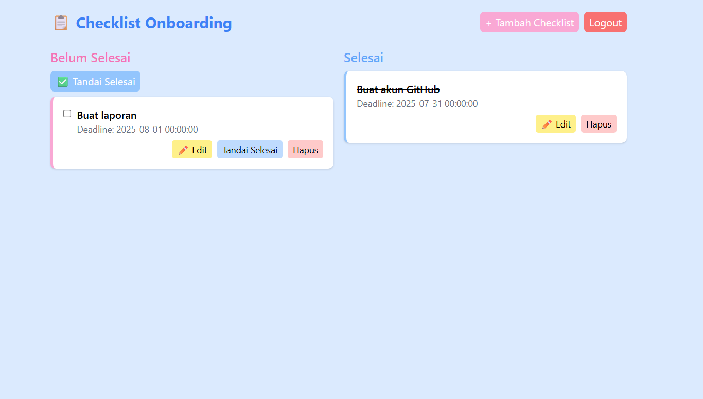

# ✅ Checklist Onboarding - Frontend React - Azzikra Ramadhanti Aksan


## 📌 Latar Belakang

AlurKerja adalah platform SaaS yang membantu perusahaan membuat, mendokumentasikan, dan menjalankan SOP secara digital menggunakan BPMN. Modul **Checklist Onboarding** ini dibuat untuk mendukung proses onboarding pengguna baru secara lebih efisien dan terstruktur.

---

## 📸 UI Preview

---

## 🚀 Tech Stack

### 🖥️ Frontend
- **React**
- **Vite**
- **TypeScript**
- **Tailwind CSS**
- **Axios** (untuk komunikasi dengan backend)

### 🖧 Backend
- **Laravel** (wajib dijalankan terlebih dahulu sebelum frontend)
- **REST API** (komunikasi antara frontend dan backend)

---

## 📦 Fitur

### 🔐 Autentikasi Pengguna
- Login user berdasarkan email dan password
- Penyimpanan token autentikasi

### ✅ CRUD Checklist
- User dapat:
  - Menambahkan item checklist (misal: Submit KTP)
  - Melihat list checklist miliknya
  - Mengedit dan menghapus checklist

- Setiap checklist memiliki:
  - Judul (string)
  - Status: "Belum Selesai" (🔴) / "Selesai" (🟢)
  - Deadline (opsional)

### 🔁 Tandai Checklist Selesai
- User bisa menandai checklist sebagai "Selesai"
- Status otomatis berubah warna berdasarkan kondisinya

### 📊 Progress Checklist (Admin)
- Admin dapat melihat semua checklist user
- Checklist dapat difilter berdasarkan nama pengguna (jika tersedia dari data user checklist)

---

## ⚙️ Cara Menjalankan Project (Frontend)
Pastikan backend Laravel sudah dijalankan terlebih dahulu di http://localhost:8000/api

1. Clone Repository
```bash
git https://github.com/azzikraaksan/saas-fe.git
```

2. Install Dependencie
```bash
npm install
```

3. Jalankan Aplikasi
```bash
npm run dev
```